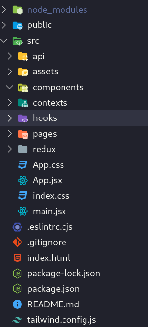
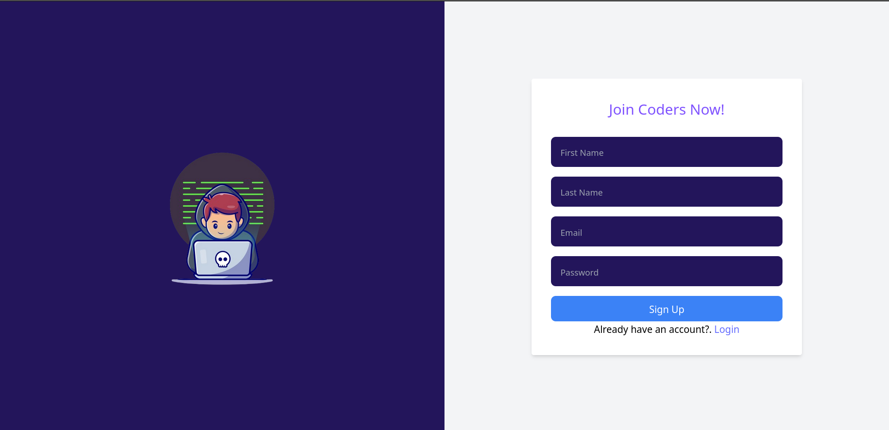
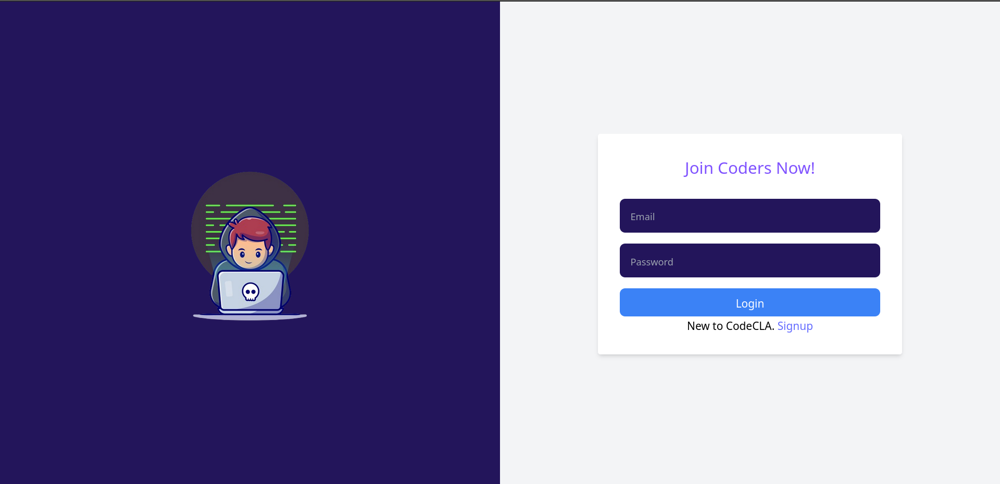

## Authentication
The first two pages that you are asked to develop are signin and signup pages.
In these assignments, we recommend you create a react application using Vite which can be looked up [here](https://vitejs.dev/),  and intialize it with tailwind css.
For the file structure, you are free to go with any structure you want but we recommend the following structure:

- In the pages folder, we put code files related to the pages
- In the components folder, we put the different react components used in these pages
- In the api folder, we put code that interacts with the remote API to fetch or mutate data
- In the contexts folder, we put things related any custom react context we use.
- In the hooks folder, we put our custom hooks
- In the redux folder, we put code for redux

### Tasks
1. Develop the signup page UI

2. Develop the signin page UI

3. Setup react router and add routing logic between the signin and signup pages.

4. Setup initial redux toolkit store where you store the authentication state to be used by you components.

5. Create a `ProtectedRoute` component that makes sure that the user is authenticated before showing the request content. If the user is not authenticated he'll be redirected to the signin page.

6. Add form validation with [react hook form](https://react-hook-form.com/)
