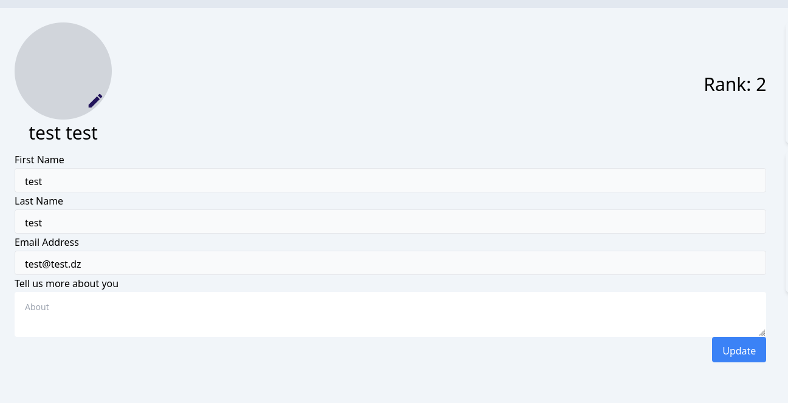
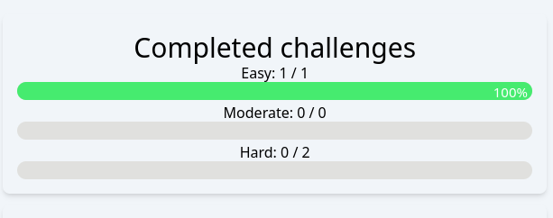

## Profile integration with backend
In this assignment, you are going to integrate to profile UI with your backend.


### Tasks
Here's the list of tasks

#### 1. View profile integration
- Add an a query endpoint in your rtk-query auth api to get the profile 
- Don't forget to add the bearer token authorization header that should be passed to your query.
- Export the hook for getting the coder's profile.
- In your your component that shows the profile data, invoke the hook and render the data properly and populate form fields as shown in the next picture.
- You should pass the token (fetched from the store) as parameter to the query (You can use your custom `useAuth` hook).
- Similar to previous assignments, you should add the loading and error component to indicate the status of the operation.



#### 2. Update profile integration
- In the same api, create a `mutation` to update the profile.
- Don't forget to add the bearer token authorization header that should be passed to your query.
- The mutation should accept `FormData` type as input (Not `JSON` data as previous requests).
- Export the mutation hook for updating the coder's profile.
- In the profile form, add proper states for various fields and add the `onClick` event listener to update the profile using the mutation function returned by the mutation hook.
- You should pass the token (fetched from the store) as parameter to the query (You can use your custom `useAuth` hook).
- Similarly, you should add the loading and error component to indicate the status of the operation.


#### 2. Solved challenges statistics integration
- Create a query endpoint in the grading api (because these are statistics related to grading) to get the solved challenges statistics.
- Don't forget to add the bearer token authorization header that should be passed to your query.
- In the component that shows the different progress bars for each difficulty levels, invoke the query (pass the token!) and render the data.

Remember that the data arrives from backend has the following format:
```json
{
  "totalEasySolvedChallenges":  1,
  "totalModerateSolvedChallenges":  0,
  "totalHardSolvedChallenges": 0,
  "totalEasyChallenges":  111,
  "totalModerateChallenges":  0,
  "totalHardChallenges": 1
}
```
And in the UI, you should render the `totalSolved / total` for that specific difficulty level, so it's mendatory to handle division by zero cases!.



- Similarly, you should add the loading and error component to indicate the status of the operation.


#### 3. HeatMap statistics integration
- Create a query endpoint in the grading api to get the heatmap statistics.
- Don't forget to add the bearer token authorization header that should be passed to your query.
- In the component that shows the heatmap, invoke the query (pass the token!) and pass the data to the `HeatMap` component (as values).
- Similarly, you should add the loading and error component to indicate the status of the operation.

#### 4. NavBar profile info integration
On login, we want to the user profile avatar, and render in the navbar (top right corner).

- After login, load the profile you should load the profile's avatar and pass it to the navbar
- In the navbar component gets the avatar and renders it