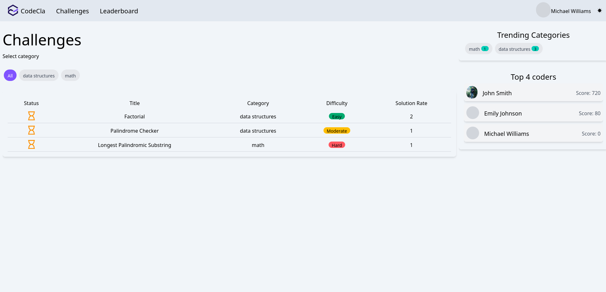
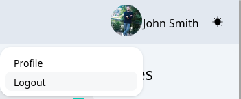
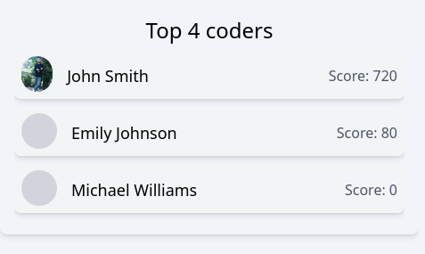
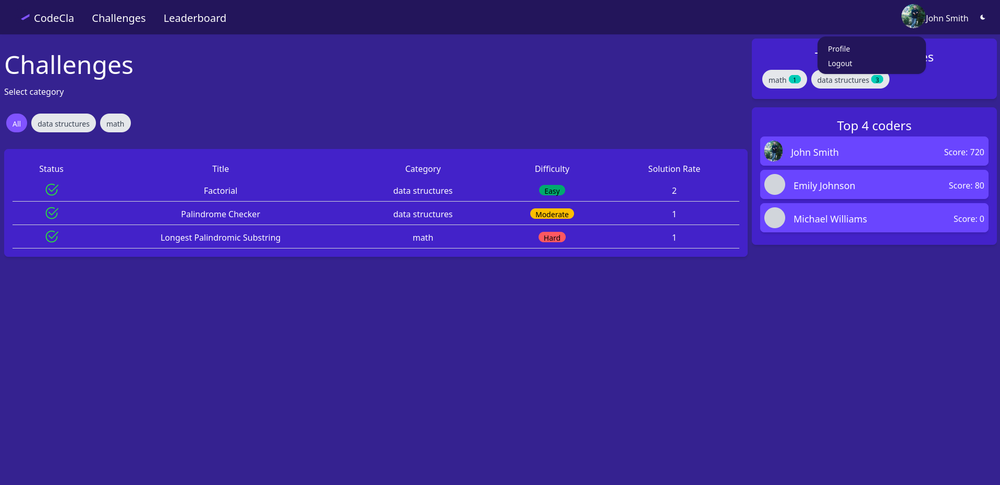

## Challenges home page
Now you're going to implement the home page which shows generale information about
the paltform, like the list of challenges that exist, categories, top trending categories and 
the top 4 ranked coders.



## Tasks
Here's the set of tasks to develop the UI for home page

### 1. Implement components
1. Implement the `Navbar` component:
    - Create a functional component named `Navbar`.
    - The `Navbar` should contain, the logo, the `challenges`, `leaderboard` links on the left and the profile avatar, the user and theme toggle on the right.
    - Add dropdown functionality for user profile options (It opens up when we click on user profile avatar).





2. Implement the `CategoriesList` component:
    - Create a functional component named `CategoriesList`` which hosts the list of challenges categories in the platform.
    - Map through the categories array and render individual `Category`  components for each category.


3. Implement the `ChallengesList` component:
    - Create a functional component named `ChallengesList`.
    - Use dummy data to populate the challenges table.
    Data shape that can be used is the following:
    ```json
    [
        {
            "id": 145,
            "title": "Two-sum",
            "description": "...", // Not used here
            "category": "Data structure",
            "Difficulty": "Easy",
            "status": "Completed",  
            "solutionRate": "45%",
            "maintainer": "Goerge Harvy", // Not used here
        },
        {
            "id": 146,
            "title": "Fibonatci series",
            "description": "...", // Not used here
            "category": "Data structure",
            "Difficulty": "Moderate",
            "status": "Attempted",  
            "solutionRate": "45%",
            "maintainer": "Goerge Harvy", // Not used here
        },
        {
            "id": 147,
            "title": "Skyline problem",
            "description": "...", // Not used here
            "category": "Data structure",
            "Difficulty": "Moderate",
            "status": "Pending",  
            "solutionRate": "45%",
            "maintainer": "Goerge Harvy", // Not used here
        }
    ]
    
    ```
    - Implement scrollable container for the table
    - For the icons you can use [react icons](https://react-icons.github.io). Here we use:
        - `BsCheck2Circle` for a `Completed` challenge.
        - `LuFileSpreadsheet` for an `Attempted` challenge.
        - `FaRegHourglass` for a `Pending` challenge
    - Implement tooltip so that when the user hovers on the status you can the description of the status as depicted in the second picture


- Implement the `TrendingCategoriesBox` component:
    - Create a functional component named `TrendingCategoriesBox`.
    This component should list the most submitted categories.
    - You can use the following data:
    ```json
        [
            {
                "category": "Graphs",
                "count": 100,
            },
            {
                "category": "Stacks",
                "count": 45,
            },
            {
                "category": "Algorthims",
                "count": 20,
            },
            {
                "category": "Databases",
                "count": 3,
            },
        ]
    ```


- Implement the `TopKCodersList` component:
    - Create a functional component named TopKCodersList.
    - Use dummy data to populate the top coders list. Here's a sample data
    ```json
        [{
            "id": 101,
            "first_name": "Alice",
            "last_name": "Johnson",
            "avatar_url": "",
            "score": 350,
        },
        {
            "id": 102,
            "firstName": "Bob",
            "lastName": "Smith",
            "avatarUrl": "",
            "score": 320,
        },
        {
            "id": 103,
            "firstName": "Emily",
            "lastName": "Davis",
            "avatarUrl": "",
            "score": 290,
        },
        {
            "id": 104,
            "firstName": "Michael",
            "lastName": "Brown",
            "avatarUrl": "",
            "score": 270,
        }
    ]
    ```
    - Implement `CoderCard` and make sure to show the avatar if it exists, an icon
    indicating its rank, its name and it score



### 2. Update the router
As a last step, make sure to layout these components in a page component named `Home`, which is the index page for the app. We can access it via two links paths: `/` and `/challenges`.


### 3. Theme toggle
Next, you are asked to implement theme toggler feature.

There are two options to implement it, either using the `context API` or `redux`. In this assignment you are going to use `redux` to implement it.

- Add a slice for theme in your redux store configuration.
- The initial state should be a value that indicates whether the application is in `light` or `dark` mode.
- Add the action reducer to toggle the theme.
- Add a toggle component to your navbar, you can make use of [react theme toggle](https://toggles.dev/docs/react) library and attach a handler that dispatches the toggle action on click events.
- For the dark theme color, you can use the colors mentioned in the introduction.

**Dark UI for home page**



>Optional: As an optional task, figure out a way to store the theme configuration in the browser, so that when the user closes the tab or his browser the theme is initialized with his last configured theme.

Happy coding! :)