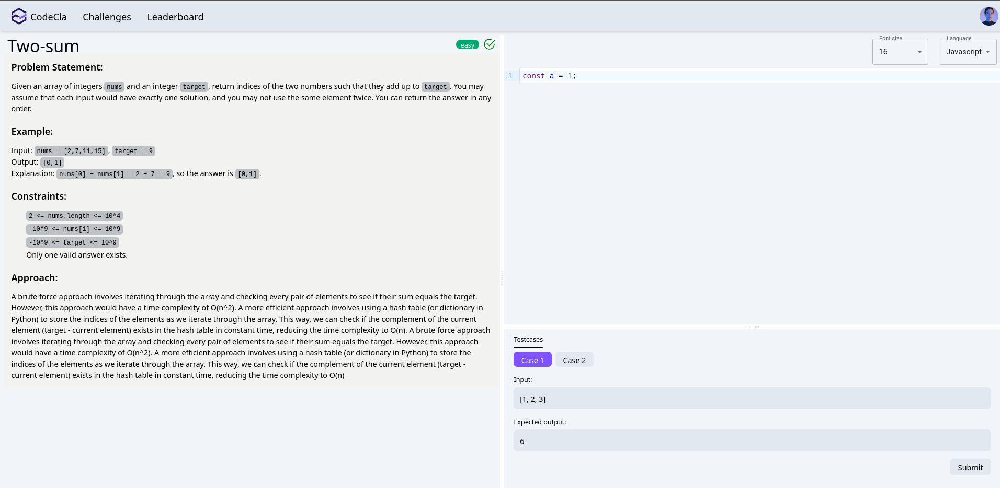
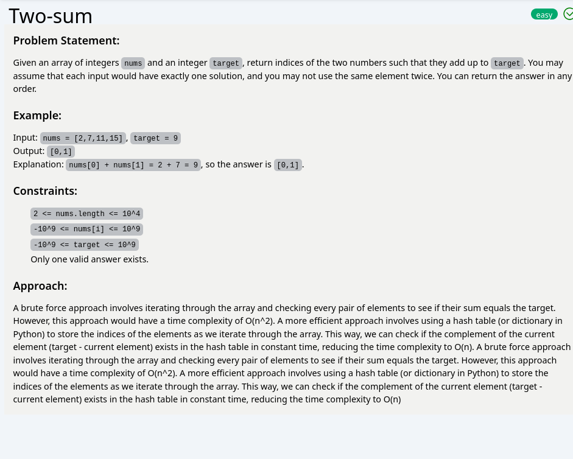
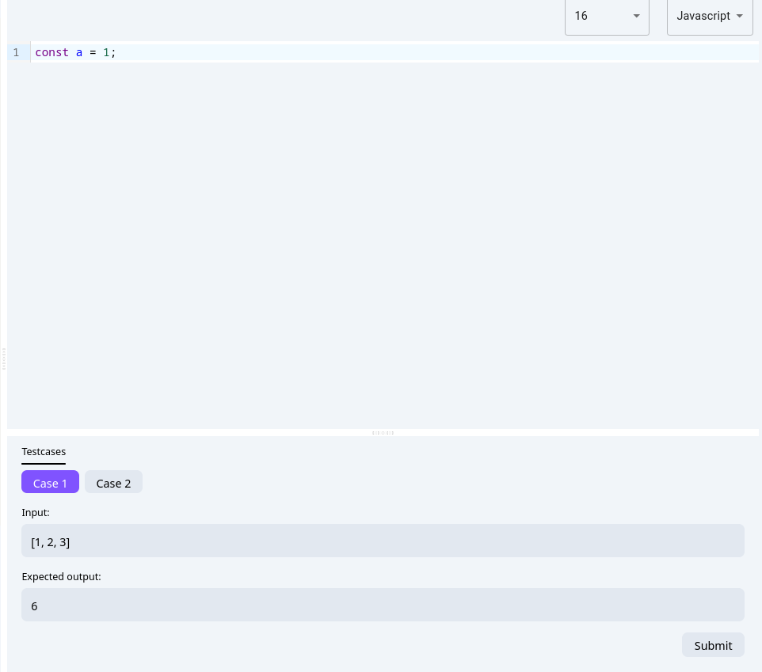

## Challenge workspace
Now, the fun part starts!. You are going to implement the workspace
where the coder will read challenge description, write the code for that challenge,
inspect the test cases and submit his solution to be graded.



## Tasks
Here are breaked down tasks

### 1) Implement workspace components
- Implement a `Worspace` component that will hold the other components.
    - The components splits the screen into two halves, the first half for a component called `ChallengeDescription` and the second for a component called `Playground` that we are going to detail in the subsequent tasks.
    - To split the screen, you can make use of `Split` component provided by [react-split](https://www.npmjs.com/package/react-split). It has a drag feature, so that you can play with size of each half.

- Implement `ChallengeDescription` component
    - The first half of the screen is for the `ChallengeDescription` component that renders a [markdown](https://www.markdownguide.org) formatted text. So it should allow us to preview that markdown.
    - To render makrdown content, you can make use of this [react-markdown-preview](https://www.npmjs.com/package/@uiw/react-markdown-preview) package. It's easy and simple to use.
    - For the data, you can start with this data, but as we move forward you are going to implement the backend and integrate it with this UI with real data.

```js
    let challenges = [{
        "id": 123,
        "title": 'Two-sum',
        "description": `
### Problem Statement:
Given an array of integers \`nums\` and an integer \`target\`, return indices of the two numbers such that they add up to \`target\`. You may assume that each input would have exactly one solution, and you may not use the same element twice. You can return the answer in any order.
### Example:
Input: \`nums = [2,7,11,15]\`, \`target = 9\`  
Output: \`[0,1]\`  
Explanation: \`nums[0] + nums[1] = 2 + 7 = 9\`, so the answer is \`[0,1]\`.
### Constraints:
- \`2 <= nums.length <= 10^4\`
- \`-10^9 <= nums[i] <= 10^9\`
- \`-10^9 <= target <= 10^9\`
- Only one valid answer exists.
### Approach:
A brute force approach involves iterating through the array and checking every pair of elements to see if their sum equals the target. However, this approach would have a time complexity of O(n^2). A more efficient approach involves using a hash table (or dictionary in Python) to store the indices of the elements as we iterate through the array. This way, we can check if the complement of the current element (target - current element) exists in the hash table in constant time, reducing the time complexity to O(n).
`, // md content,

    "difficulty": 'Easy',
    "category": 'arrays',
    "status": "Completed",
    "tests": [
        {
            "id": 1,
            "input": {}, // Not used here
            "inputText": `[1, 2, 3]`,
            "output": {}, // Not used here
            "outputText": `6`
        },
        {
            "id": 'test_2',
            "input": {}, // Not used here
            "inputText": `[2, 3]`,
            "output": {}, // Not used here
            "outputText": `5`
        }
    ]
    }
]

```



- Implement `Playground` component: \
The second half of the screen is split into two halves as well, one for the code editor and one for rendering the test cases and submit the solution for that challenge. You use the same library to split the screen but **vertically** this time.

    - Let's start by the code editor, for this you are going to use the powerfull tool called [react-codemirror](https://www.npmjs.com/package/@uiw/react-codemirror). It comes with support for wide range of programming languages but in our palatform, we support **Python** and **Javascrirpt** only. It has support for light and dark themes as well!.
    - In the top add two configuration options, the programming language and the font size of the code.
    - These configuration options are stored in redux store in slice that you can call `workspace`.
    - You have to implement a `DropDown` component for these configuration options. You can use [material ui select](https://mui.com/material-ui/react-select/) component to implement it.
    - Finally, for the second half of the `Playground` component, we show the test cases
        - The coder can select a test case from different cases for that challenge.
        - We show the input text and the expected output text for that test case.
        - A submit button is used to submit the code to the `grading` service in the backend later.




### 2) Update the routing
- The `Workspace` page should be accessed via a route `/workspace/:challengeId`, the `challengeId` is a route parameter used to fetch the challenge's data.
- The challenges in the home page link to the workspace page.
