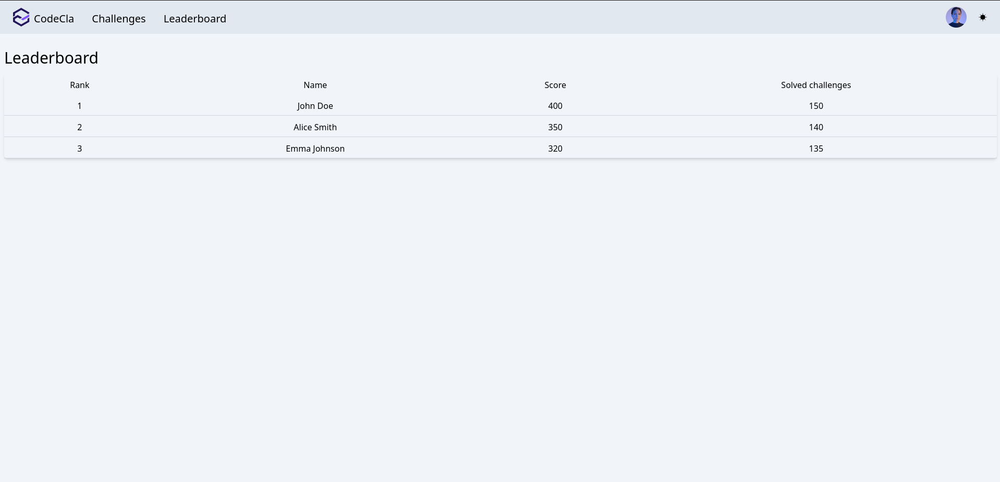
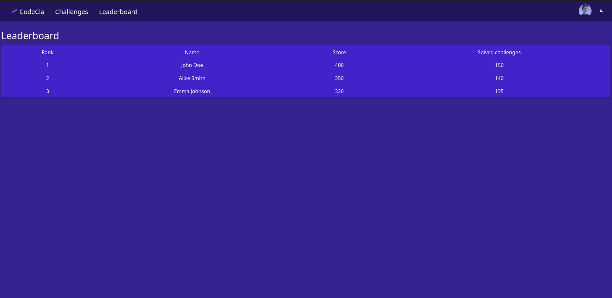

## Leaderboard page
The application provides a page where the coder can see the leaderboard of top
coders.

### Light view


### Dark view


### Tasks
Here's the list of tasks

### 1) Implement Page layout and components

- Create a leaderboard page that contains a table with the following information: `Rank`, `Name` which is the concatenation of the `first name` and `last name`, `Score` and lastly the `Solved challenges` which indicates the number of solved challenges.

You can use the following dummy data:
```json
[
  {
    "rank": 1,
    "first_name": "John",
    "last_name": "Doe",
    "score": 400,
    "solved_challenges": 150
  },
  {
    "rank": 2,
    "first_name": "Alice",
    "last_name": "Smith",
    "score": 350,
    "solved_challenges": 140
  },
  {
    "rank": 3,
    "first_name": "Emma",
    "last_name": "Johnson",
    "score": 320,
    "solved_challenges": 135
  }
]

```

- Add the page to a route under `/leaderboard`.


>Note: You are going to use real data from backend once you finish backend tasks and do the integration

### 4) Ensure theming
- Make sure that profile page supports light and dark modes.