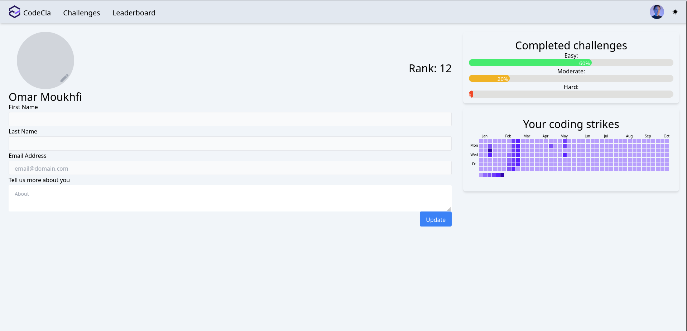
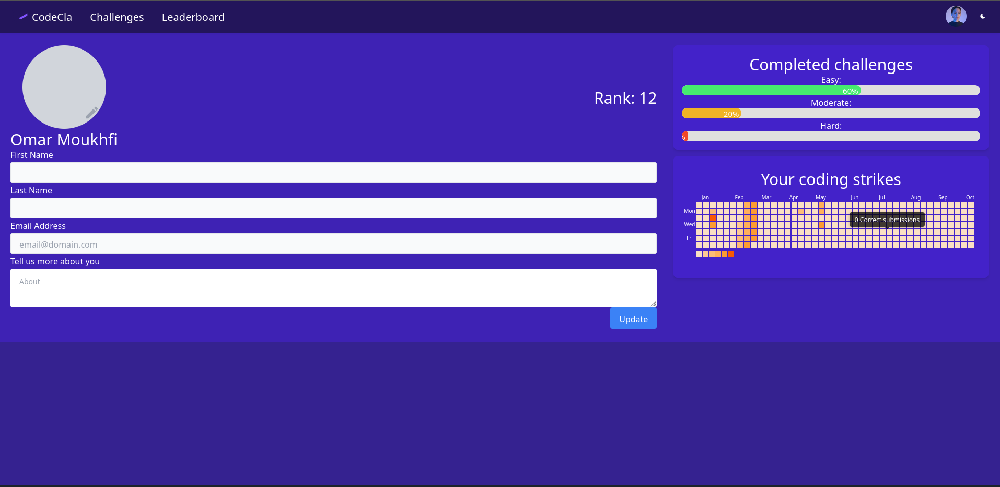
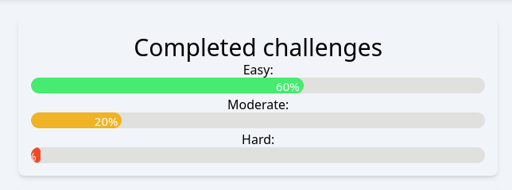
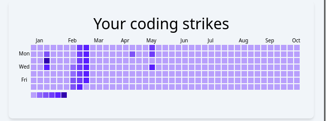
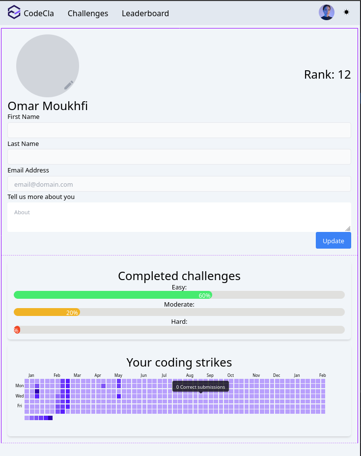

## Profile page
The coder can see and manage his profile. The profile page contains a form to update various information about the coder
like his avatar, his first name, last name and his bio (The email is fixed and can not be changed).

### Light view


### Dark view


### Tasks
Here's the list of tasks

### 1) Implement Page layout

- Create a component called `Profile` that will host the content of the profile page.

- Add the page to the routes `/profile`.

### 2) Implement profile form

- Create a `ProfileForm` component that contains the form as shown in the previous picture.
- For the avatar, once the user clicks on the edit icon, a file explorer opens up to select the image and it should be previewed on that circle.
- Make sure that the mail is read-only field.

### 3) Implement statistics components
On the right hand side of the page, we show general statistics about the coder's performance

- Implement the component that shows statistics completed challenges percentages (You can add a label to show the ration of completed easy challenges, for example 30 / 50 which means 30 challenges out of 50 easy challenges are solved which corresponds to 60%).

>Note: Once you implement the backend part you'll be sending the `number of solved challenges` and the `total number of challenges` of a specific hardness level and you calculate the percentage in the frontend side.




- Implement submission strikes `Heatmap` that shows the number of **accepted** submissions over the last year. You can make use of [react-heat-map](https://www.npmjs.com/package/@uiw/react-heat-map) library.



You can use this pannel color scheme for the `dark` and `light` themes.
```js
const pannelColor = {
    dark: {
      0: '#fadfc3',
      2: '#fcca95',
      4: '#fcbc77',
      10: '#ffaf59',
      20: '#fc9b32',
      30: '#fa5902'
    },
    light: {
      0: '#b89ffc',
      2: '#916afc',
      4: '#7e52f7',
      10: '#6f3cfa',
      20: '#5a1fff',
      30: '#2f03ad',
    }
  }
```


### 4) Ensure responsiveness and theming
- Here's the UI for small screen sizes



- Make sure that profile page supports light and dark modes.

