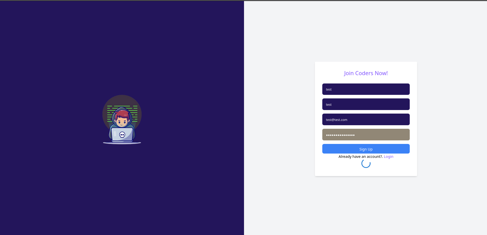
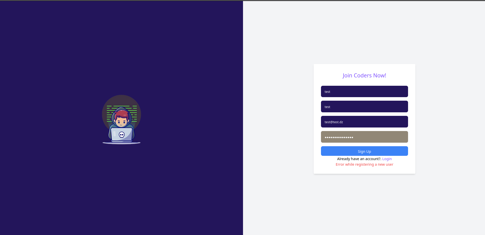
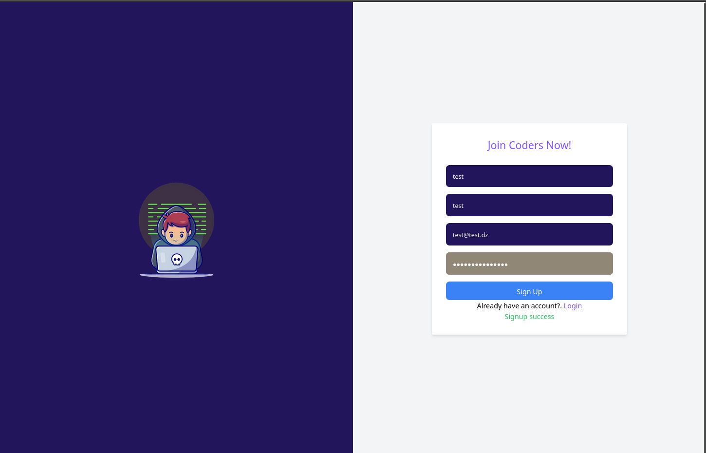

## Authentication integration with Backend
Now, that you have a react application for the coder dashboard and a fully functional backend service, you are ready to start this assignemnt that focuses on integrating your react app with your backend service.

You are going to refine your react code to meet the backend service responses.

A main tool that you need to use is a data fetching library. For this we recommend, as stated previously, the [rtk-query](https://redux-toolkit.js.org/rtk-query/overview) library for its seamless integration with redux-toolkit.

In this assignment, you are going to integrate the authentication feature (signup and signin)

### Tasks
Here's the list of tasks todo

#### 1. Signup integration
- First setup your rtk-query api for authentication and add to the redux store configuration.
- Create the endpoint `mutation` for signup.
- Next, you need to export the signup mutation hook created by rtk-query.

- Next, you should refactor your signup component to use the signup mutation hook provided by RTK-Query.
- You should add a loading component that shows up before getting the response and it should disappear after getting a response.
- You should add error component that shows up if there an error in the registration process.

**Signup loading**

**Signup error**

**Signup success**

#### 2. Signin integration
- Create the endpoint `mutation` for signing in.
- Next, you need to export the signin mutation hook created by rtk-query.

- Next, you should refactor your signin component to use the signin mutation hook provided by RTK-Query.
- You should create an authentication slice in your redux store to manage the auth state, that mainly contains the authentication token.
- Add the necessary reducers for login and logout actions. 
- As in the previous case, you should add a loading component that shows up before getting the response and it should disappear after getting a response.
- As the previous case, you should add error component that shows up if there an error in the login process.
- On a successfull login, actions should be taken in the store and the user user should be redirected to the home page.
- That token will be used in the headers of subsequent requests, so you should think about a way of how to persist it in the browser's side. (Hint: check [localSotrage](https://developer.mozilla.org/en-US/docs/Web/API/Window/localStorage) and [sessionStorage](https://developer.mozilla.org/en-US/docs/Web/API/Window/sessionStorage))

### 3. Protected route refactor
- Now, you should update your protected route to check of the availability of the token in the store.
- We recommend you to create a custom hook that you can call `useAuht` which checks and retrieves the token from the store.

