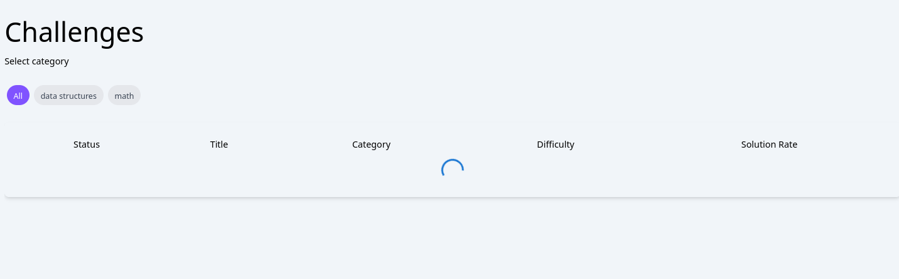
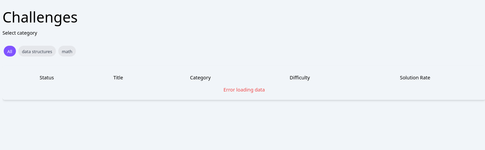

## Challenges page integration with backend
In this assignment, you are going to integrate your home page with your backend service.

### Tasks
Here's the list of tasks todo:

First you need to create an rtk-query api for challenges-related requests and add it to redux store configuration.

>Note: console.log is your friend!, use it for logging the response from the backend and inspect the comming data before rendering it.

#### 1. Categories list integration
- Create an endpoint in your rtk-query api, to get the list of categories.
- Don't forget to add the bearer token authorization header that should be passed to your query.
- Export the hook for getting the categories.
- In your your component that lists the categories, invoke the hook and render the data properly.
- You should pass the token (fetched from the store) as parameter to the query (You can use your custom `useAuth` hook).
- Similar to the previous assingment, you should add the loading and error component to indicate the status of the operation.
>Note: As you know, the backend returns only the list of categories, so you should add another element for `All` in the list of categories in the rendered UI.

#### 2. Challenges list integration

- Create an endpoint in your rtk-query api, to get the list of challenges.
- Don't forget to add the bearer token authorization header that should be passed to your query.
- Export the hook for getting the challenges.
- In your your component that lists the challenges, invoke the hook and render the data properly.
- You should pass the token (fetched from the store) as parameter to the query (You can use your custom `useAuth` hook).
- Similarly, you should add the loading and error component to indicate the status of the operation.

For example:

**Loading challenges**

**Error loading challenges**

#### 3. Challenges filtering integration

- Update the endpoint of getting all the challenges to accept another argument for the challenge `category` that will be passed as a query argument in the URL.
- If the user selects a category, you need to refetch the challenges to get the challenges of that category only.

#### 4. Trending categories integration

- Create an endpoint in your rtk-query api, to get the trending categories.
- Don't forget to add the bearer token authorization header that should be passed to your query.
- Export the hook for getting the trending categories.
- In your your component that lists the trending categories, invoke the hook and render the data properly.
- You should pass the token (fetched from the store) as parameter to the query (You can use your custom `useAuth` hook).
- Similarly, you should add the loading and error component to indicate the status of the operation.

#### 5. Top k coders integration

- Create a new api for `leaderboard`-realted requests.
- Add an endpoint to get the top k coders. The query should accept the token and `k` that will be passed as a query argument in the URL.
- Don't forget to add the bearer token authorization header that should be passed to your query.
- Export the hook for getting the trending categories.
- In your your component that lists the trending categories, invoke the hook and render the data properly.
- You should pass the token (fetched from the store) as parameter to the query (You can use your custom `useAuth` hook).
- Similarly, you should add the loading and error component to indicate the status of the operation.

After you finish these tasks successfully, you'll end up with a fully functional home page.
