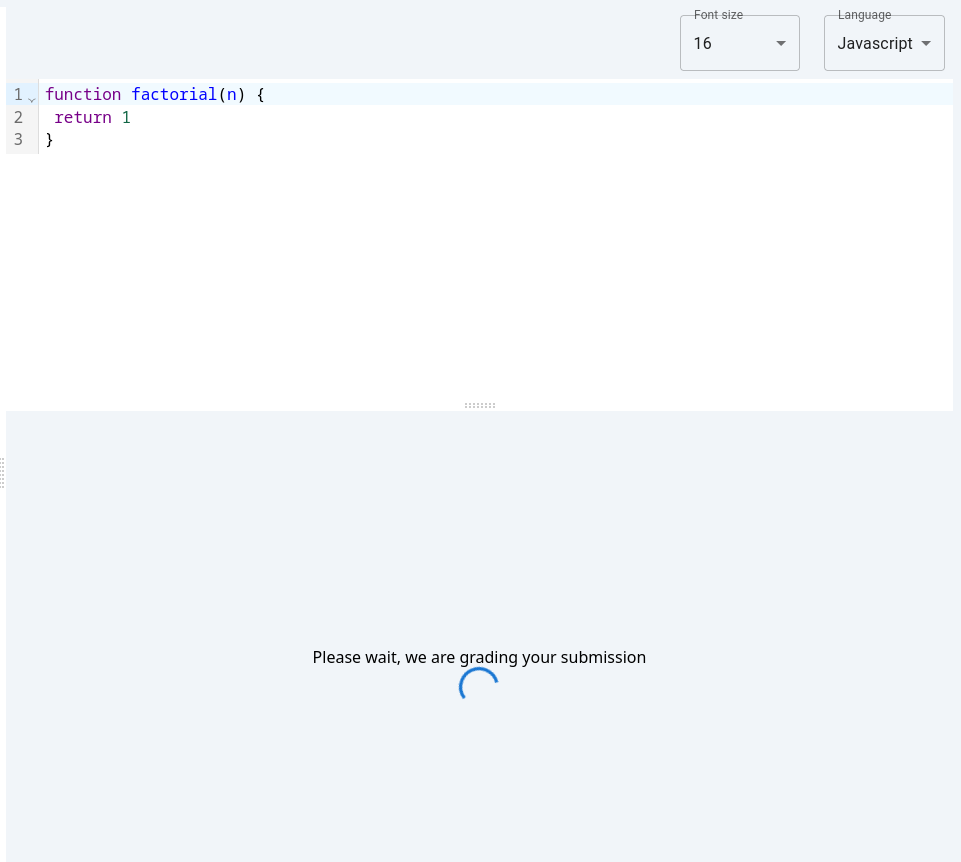
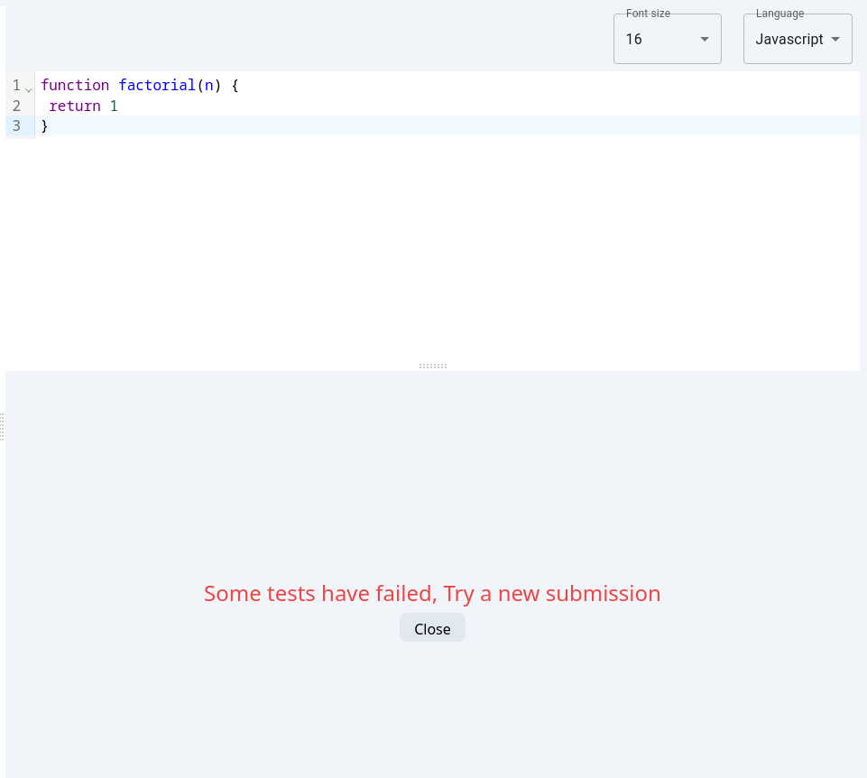
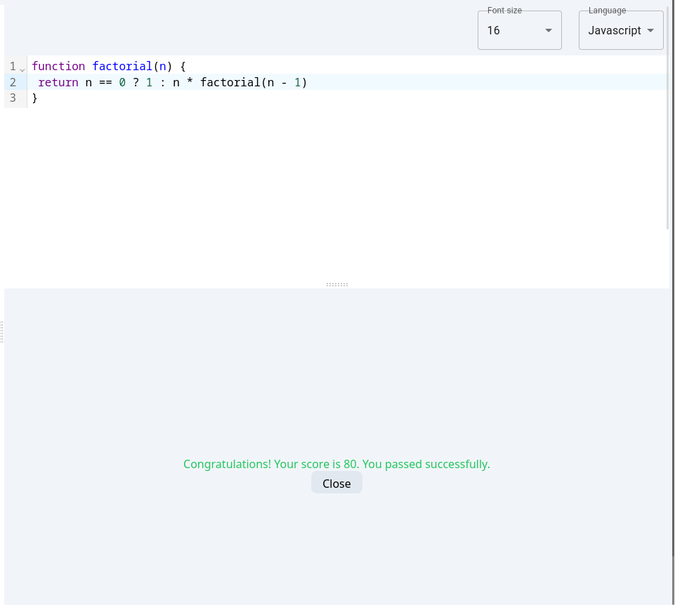
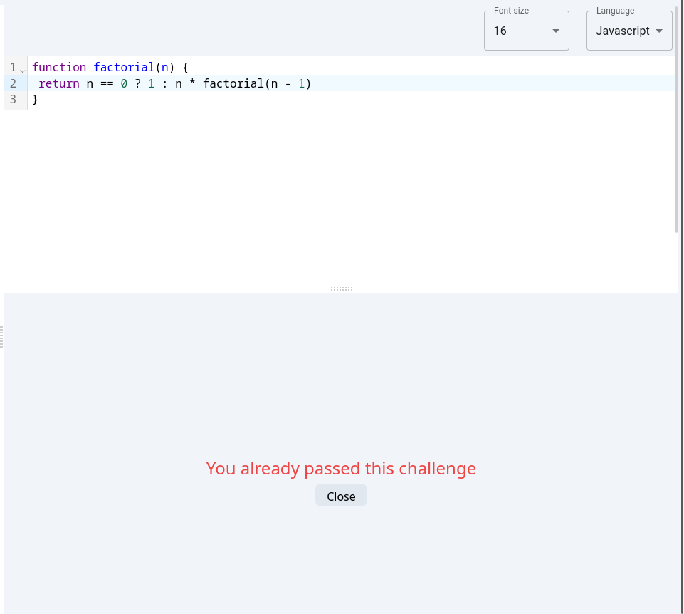

## Challenge workspace integration
In this assignement, you're going to integrate the workspace page with your backend

### Tasks
Here's the list of tasks

#### 1. Challenge description and playground integration

- First, add an endpoint to get a challenge by its id that should be passed to the query.
- Don't forget to add the bearer token authorization header that should be passed to your query.
- Export the hook for getting a specific challenge.
- In your your workspace, invoke the challenge getter hook and render the data properly (Render the challenge descritpion and playground tests).
- You should pass the token (fetched from the store) as parameter to the query (You can use your custom `useAuth` hook).
- Similar to previous assignments, you should add the loading and error components to indicate the status of the operation.
- As you know, the challenge data from backend contains intial code for different language (`py` and `js` in our case). So make sure to show the proper code based on the language dropdown selector.
- Also, whenver the coder writes code in a language for example in `js` and we select another language (`py`) and go back to `js`, make sure to save the written code in each language (Hint: Think about using `useRef` to achieve it).

#### 2. Submission integration
- First create a new api for `grading` and configure it with redux as previously.
- Add a `mutation` endpoint to `submit` a code for a challenge. It's a `POST` request and should pass submission data in the request's body.
- Whenever the coder clicks on submit button, his code will be sent for grading.
- The grading request takes some time, so we show a loading component instead of of the test cases UI. If there's an error, a message will appear and close button should be provided to `close` it and show the tests again. In case of success, a success message should appear along with the `close` button as shown in the following pictures.

**Loading grading**

**Tests failed**
In case testing failures

**Tests passed**
In case testing passed

**Submitting an already solved challenge**
If th coder submits an already solved challenge, he gets this

After you finish these tasks successfully, you'll end up with a fully functional coding workspace!.
