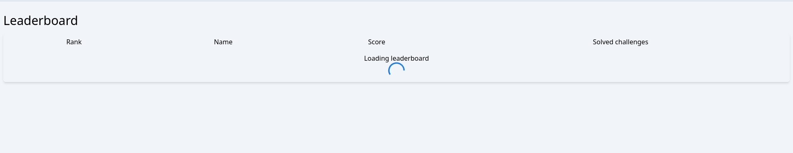
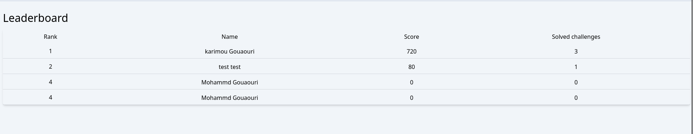
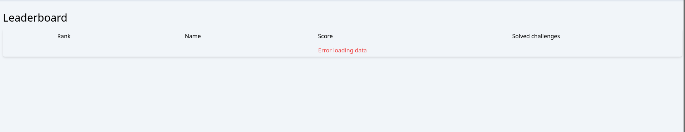

## Leaderboard integration with backend
In this assignment, you are going to integrate the leaderboard page with backend.

### Tasks
Here's the list of tasks

- Create an endpoint to get the leaderboard
- Don't forget to add the bearer token authorization header that should be passed to your query.
- Export the hook for getting the leaderboard.
- In your your component that shows the leaderboard, invoke the hook and render the data properly.
- You should pass the token (fetched from the store) as parameter to the query (You can use your custom `useAuth` hook).
- Similarly, you should add the loading and error component to indicate the status of the operation.

**Leaderboard loading**

**Leaderboard success**

**Leaderboard error**

After you finish these tasks successfully, you'll end up with a fully functional leaderboard page.
